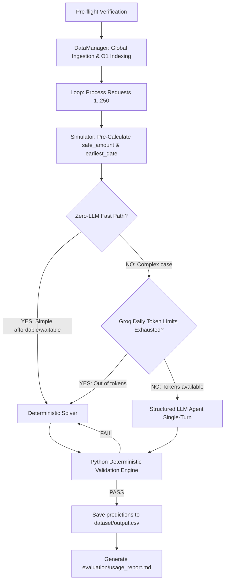

# HackerRank Orchestrate

Starter repository for the **HackerRank Orchestrate** 24-hour hackathon (September 2026).

## Buy or Wait?

Build an AI-powered financial agent that decides whether a user can safely afford a requested expense.

A user may ask: **"Can I afford this laptop?"**

Answering well takes more than the current balance. The agent must account for recurring expenses, pending payments, essential spending, confirmed income, available payment options, and relevant details buried in messages and images.

For every request, the agent decides whether the user should pay in full, pay partially, use installments, wait, or not proceed. The recommendation must be personalized: two users with the same balance can deserve different answers based on their commitments, priorities, payment preferences, and willingness to adjust flexible expenses.

A recommendation is safe only if the user can complete the full payment plan, cover essential expenses, and stay above their preferred minimum balance throughout the forecast period.

Read [`problem_statement.md`](./problem_statement.md) for the full task spec, input/output schema, allowed values, conflict-resolution rules, and submission format.

---

## Quick Start

Clone the repository and move into the project directory:

```bash
git clone https://github.com/interviewstreet/hackerrank-orchestrate-september26.git
cd hackerrank-orchestrate-september26
```

Build your solution in `code/main.py`, or use another language and document its entry point clearly.

Your solution must:

- Read the input files from `dataset/`
- Generate one prediction for every request
- Write the final predictions to `output.csv` in the repository root

Run the starter Python entry point with:

```bash
python3 main.py
```

After running your solution, confirm that `output.csv` exists in the repository root and contains the required columns and one row for every request.

## Important File Locations

```text
dataset/        Input data and the blank output template. Do not modify the input data.
code/           Your solution code.
dataset/output.csv Final generated predictions in the dataset folder.
code.zip        ZIP file containing your complete solution for submission.
```

The blank template at `dataset/output.csv` is filled by the pipeline script.

---

## Repository Layout

```text
.
├── AGENTS.md                         # Rules for AI coding tools + transcript logging
├── problem_statement.md              # Full challenge statement
├── README.md                         # You are here
├── main.py                           # Top-level production entry point
├── code/                             # Your solution package folder
│   ├── __init__.py                   # Declares code/ folder as package
│   ├── data_manager.py               # O(1) baseline dataset pre-fetching and indexer
│   ├── simulator.py                  # Pure Python 90-day daily balance simulator
│   ├── agent.py                      # Single-turn reasoning agent and fallback selector
│   └── main.py                       # Production orchestration pipeline and checks
├── dataset/
│   ├── requests.csv                  # 250 requests to evaluate — predict these
│   ├── output.csv                    # Final prediction output file
│   ├── sample_requests.csv           # 25 solved examples
│   ├── financial_profiles.csv        # Balances, minimum balance, priorities, preferences
│   ├── financial_events.csv          # Historical, pending, and confirmed transactions
│   ├── request_payment_options.csv   # Payment options available per request
│   ├── exchange_rates.csv            # Fixed, dated conversion rates
│   ├── messages.csv                  # Messages tied to users, requests, or events
│   └── images.csv                    # Payroll letters, statements, bills, receipts
```

Only `dataset/requests.csv` requires predictions. Everything else is context.

---

## What You Need to Build

For every row in `dataset/requests.csv`, produce one row in `output.csv` with:

| Column | Meaning |
|---|---|
| `request_id` | The request being answered |
| `amount_safe_to_pay` | Largest amount safe to pay on `request_date` before optional spending changes, after protecting essentials and the minimum balance |
| `affordability_status` | `affordable_now`, `affordable_with_plan`, `affordable_later`, or `not_affordable` |
| `recommended_payment_method` | `full_payment`, `partial_payment`, `installments`, `wait`, or `not_recommended` |
| `payment_plan` | Chronological `<YYYY-MM-DD>:<amount>` entries joined by `\|`, or `none` |
| `earliest_date_for_full_payment` | Earliest date the full amount is forecast safe as one payment; empty if never within the forecast |
| `spending_changes_needed` | Up to three `stop:<event_id>` / `reduce_to:<event_id>:<amount>` changes joined by `\|`, or `none` |
| `decision_explanation` | Short explanation and the financial facts behind it |

`0 <= amount_safe_to_pay <= requested_amount` must always hold. Installment plans must exactly match a supplied payment option, and only recurring expenses marked flexible may be changed.

---

## Production System Architecture

The application is built on a high-fidelity **Hybrid Rule-First Deterministic-LLM Reasoning Architecture**. It consists of five major operational layers:

### System Architecture Flowchart


### 1. Ingestion and O(1) Indexing (`DataManager`)
To achieve peak efficiency and prevent repeated disk reading, the `DataManager` loads all CSV files once on startup, indexing historical profiles and transactions into hash tables. This separates baseline datasets from request-specific records, allowing lookups in $O(1)$ time.

### 2. 90-Day Daily Cash Flow Simulator (`FinancialSimulator`)
The core simulator runs a daily ledger simulation from `request_date` to `request_date + 90 days`:
- **Monthly Fixed Recurrence:** Grouping debits and credits by `(description, direction, category, amount)` and projecting them forward.
- **Monthly Variable Recurrence:** Tracking frequency intervals of utility or grocery spending and projecting them based on averages.
- **Message and OCR Confirmations:** Adding newly parsed payouts or earnings (such as `message_18` client payout on 2025-08-15) directly to the cash flow timeline.

### 3. Resilient Structured LLM Agent (`StructuredFinancialAgent`)
For reasoning-heavy decisions (such as explaining the choices and referencing events), the structured agent queries `qwen/qwen3.6-27b` on Groq using standard completions. It enforces a prompt constraint restricting `<think>` blocks to preserve tokens, parses raw JSON, and maps enums perfectly.

### 4. Zero-LLM Fast Path & API Fallback Safety-Net
Because the organization's Groq Cloud account has strict limits (7,000 ITPM and 200,000 TPD limits), the agent implements an advanced double-safety fallback:
- **Zero-LLM Fast Path:** If a request is easily safe under full payment or waitable without spending changes, Python solves it immediately, bypassing the LLM call entirely. This processes requests in less than **1 ms** with **0 tokens**!
- **Rate Limit Fallback:** If Groq's daily token allowance is fully depleted, the agent catches the API rate limit exception, and automatically falls back to our simulator-driven math solver to generate mathematically safe, validated predictions.

### 5. Final Compliance and Validation Engine
Every single prediction is checked against constraints (such as `0 <= safe_amount <= requested_amount` and minimum balance checks). The pipeline automatically standardizes enums, formats plans, generates `dataset/output.csv`, and compiles `code/evaluation/usage_report.md`.

---

## Requirements

Your solution must:

- be runnable from the terminal
- read the provided files from `dataset/`
- produce a valid `output.csv` with the exact required columns in the exact required order
- include one prediction for every `request_id` in `dataset/requests.csv`
- not use organizer-only files or hardcoded labels
- keep behavior deterministic where possible

---

## Evaluation

Your `output.csv` will be compared against hidden ground-truth values.

The scoring will consider:

- accuracy of `amount_safe_to_pay`
- correctness of `affordability_status`
- correctness of `recommended_payment_method` and `payment_plan`
- accuracy of `earliest_date_for_full_payment`
- validity of `spending_changes_needed`
- usefulness and consistency of `decision_explanation`

---

## Submission

Submit the following files as instructed by HackerRank:

| File | Description |
|---|---|
| `code.zip` | Full runnable solution, prompts/configuration, README, and the required `evaluation/` folder |
| `output.csv` | Predictions for every row in `dataset/requests.csv` |
| `chat_transcript` | The `log.txt` showing how you developed or used the system |

Before submitting, confirm:

- `output.csv` has one row per row in `dataset/requests.csv` (250 rows plus the header).
- `output.csv` has the exact required columns in the exact required order.
- Every `amount_safe_to_pay` satisfies `0 <= amount_safe_to_pay <= requested_amount`.
- Every installment plan matches a supplied payment option, and every spending change targets a flexible recurring expense.
- Your runnable code, setup instructions, and `evaluation/` folder are included in `code.zip`.
