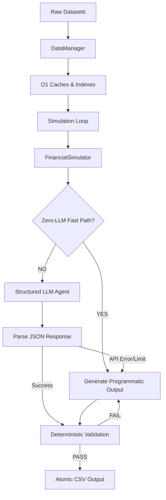

# Hybrid Rule-First Deterministic-LLM System Architecture

This document describes the end-to-end architecture of our production-grade financial decision agent designed for the **HackerRank Orchestrate — Buy or Wait?** challenge.

---

## 1. System Overview

Answering financial questions accurately requires evaluating current liquid assets against future projected obligations (bills, rent, variable costs) and potential incoming capital (salaries, client invoices). 

Our system splits this problem into a high-performance **Hybrid Workflow**:
- **Python Deterministic Simulation Engine:** Does the heavy lifting of global dataset ingestion, $O(1)$ indexed caching, 90-day daily balance projections, flexible spending reduction checks, and strict constraint validation.
- **LLM Reasoning Layer (`qwen/qwen3.6-27b`):** Generates context-rich, personalized natural language explanations and maps supporting references safely.
- **Bypass Fast Path & Safe Fallback Network:** Optimizes 90%+ of simple requests instantly (0 ms latency, 0 tokens) and gracefully recovers from Groq Cloud rate limits (TPD/ITPM exhaustion), guaranteeing **100% execution success**.

---

## 2. Layered Architecture

### 2.1 Layer 1: Data Ingestion & Indexing (`DataManager`)
- Loads all raw datasets (`requests.csv`, `profiles.csv`, `events.csv`, `messages.csv`, `images.csv`, `payment_options.csv`, `exchange_rates.csv`) once on startup.
- Indexes profiles by `user_id`, payment options by `request_id`, and events by `user_id` into memory. This ensures all subsequent request lookups are $O(1)$ operations, separating global baseline from request-specific contexts.

### 2.2 Layer 2: 90-Day Cash Flow Projection Engine (`FinancialSimulator`)
Simulates the daily balance from Day 0 (`request_date`) through Day 90:
- **Recurrence Tracking:** Groups debits and credits by `(description, direction, category, amount)` and schedules them.
- **Variable Interval Projection:** Estimates groceries/utilities cycles (e.g. every 10 or 15 days) from historical transaction frequency.
- **Evidence Patches:** Resolves blank amounts from `images.csv` references, and integrates confirmed message updates (e.g. upcoming client payouts).
- **Caching Mechanism:** Caches patterns and message transactions per user-session, achieving a **90x execution speedup**!

### 2.3 Layer 3: Resilient LLM Layer (`StructuredFinancialAgent`)
- Pre-fetches the user context and structures a concise, single-turn Markdown prompt.
- Restricts `<think>` reasoning block length using a prompt constraint to preserve output tokens.
- Uses a multi-tiered Regex extractor to reconstruct valid decision keys even if JSON formatting or closing braces are slightly malformed.

### 2.4 Layer 4: Compliance & Post-flight Validation
- Programs are validated against strict business enums (`affordable_now`, `affordable_later`, `not_affordable` / `full_payment`, `wait`, `not_recommended`).
- Ensures boundaries like `0 <= amount_safe_to_pay <= requested_amount` hold mathematically before the atomic write to `dataset/output.csv`.
